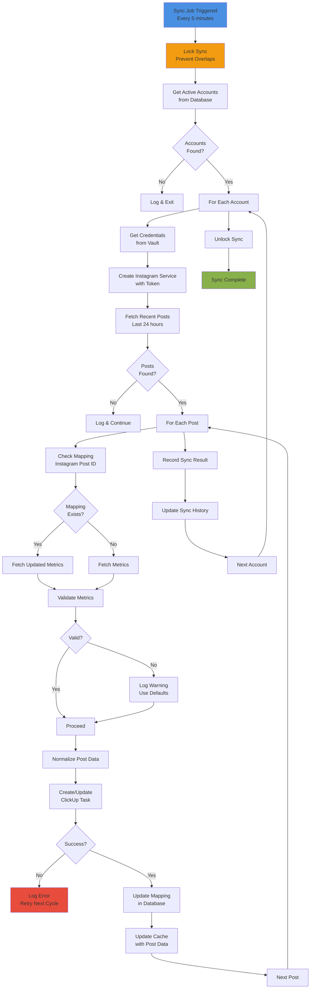
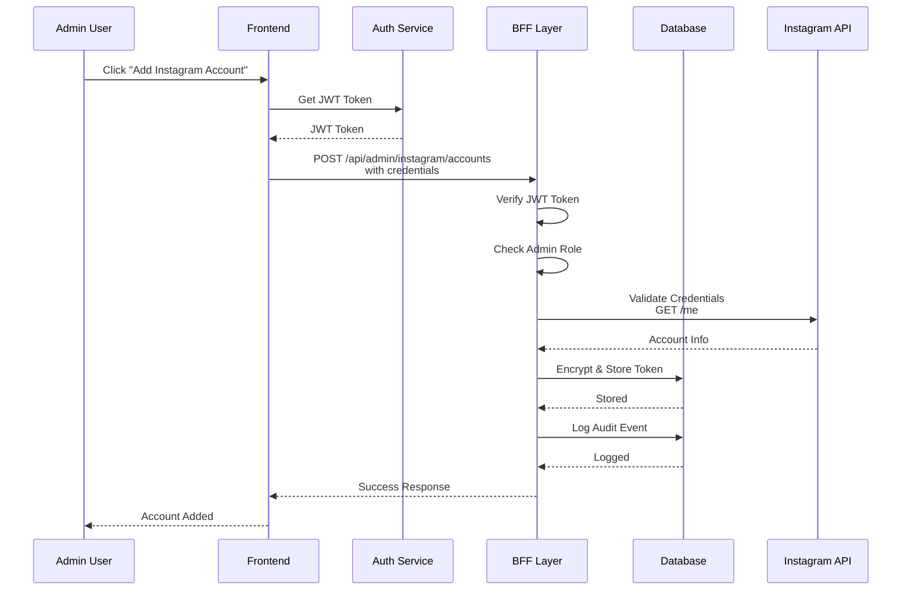

# Detalhes de Arquitetura: Instagram Business Integration

## 1. Fluxo Completo de Sincronização



## 2. Estrutura de Dados Detalhada

### 2.1 Tabelas do Banco de Dados

```sql
-- Tabela 1: Credenciais do Instagram
CREATE TABLE instagram_credentials (
  id UUID PRIMARY KEY DEFAULT gen_random_uuid(),
  account_id VARCHAR(255) UNIQUE NOT NULL,
  account_name VARCHAR(255) NOT NULL,
  business_account_id VARCHAR(255) NOT NULL,
  access_token_encrypted TEXT NOT NULL,
  clickup_list_id VARCHAR(255) NOT NULL,
  is_active BOOLEAN DEFAULT true,
  created_at TIMESTAMP DEFAULT CURRENT_TIMESTAMP,
  last_validated_at TIMESTAMP,
  expires_at TIMESTAMP,
  created_by UUID NOT NULL REFERENCES auth.users(id),
  updated_at TIMESTAMP DEFAULT CURRENT_TIMESTAMP,
  
  CONSTRAINT valid_account_id CHECK (account_id ~ '^[a-z0-9-]+$'),
  CONSTRAINT valid_business_account_id CHECK (business_account_id ~ '^[0-9]+$')
);

-- Tabela 2: Mapeamento Instagram <-> ClickUp
CREATE TABLE instagram_post_mappings (
  id UUID PRIMARY KEY DEFAULT gen_random_uuid(),
  instagram_post_id VARCHAR(255) NOT NULL,
  instagram_account_id VARCHAR(255) NOT NULL REFERENCES instagram_credentials(account_id) ON DELETE CASCADE,
  clickup_task_id VARCHAR(255) NOT NULL,
  clickup_list_id VARCHAR(255) NOT NULL,
  last_metrics_update TIMESTAMP,
  created_at TIMESTAMP DEFAULT CURRENT_TIMESTAMP,
  updated_at TIMESTAMP DEFAULT CURRENT_TIMESTAMP,
  
  UNIQUE(instagram_post_id, instagram_account_id),
  CONSTRAINT valid_post_id CHECK (instagram_post_id ~ '^[0-9]+$'),
  CONSTRAINT valid_task_id CHECK (clickup_task_id ~ '^[a-z0-9]+$')
);

-- Tabela 3: Histórico de Sincronização
CREATE TABLE instagram_sync_history (
  id UUID PRIMARY KEY DEFAULT gen_random_uuid(),
  account_id VARCHAR(255) NOT NULL REFERENCES instagram_credentials(account_id) ON DELETE CASCADE,
  status VARCHAR(50) NOT NULL CHECK (status IN ('success', 'partial', 'failed')),
  posts_processed INTEGER NOT NULL DEFAULT 0,
  tasks_created INTEGER NOT NULL DEFAULT 0,
  tasks_updated INTEGER NOT NULL DEFAULT 0,
  metrics_updated INTEGER NOT NULL DEFAULT 0,
  error_message TEXT,
  duration_ms INTEGER NOT NULL,
  started_at TIMESTAMP DEFAULT CURRENT_TIMESTAMP,
  completed_at TIMESTAMP DEFAULT CURRENT_TIMESTAMP
);

-- Tabela 4: Audit Log
CREATE TABLE instagram_audit_log (
  id UUID PRIMARY KEY DEFAULT gen_random_uuid(),
  action VARCHAR(50) NOT NULL CHECK (action IN ('CREATE', 'UPDATE', 'DELETE', 'VALIDATE', 'SYNC')),
  resource_type VARCHAR(50) NOT NULL CHECK (resource_type IN ('CREDENTIAL', 'MAPPING', 'SYNC')),
  resource_id VARCHAR(255) NOT NULL,
  user_id UUID NOT NULL REFERENCES auth.users(id),
  changes JSONB,
  status VARCHAR(50) NOT NULL CHECK (status IN ('SUCCESS', 'FAILURE')),
  error_message TEXT,
  ip_address INET,
  created_at TIMESTAMP DEFAULT CURRENT_TIMESTAMP
);

-- Índices para Performance
CREATE INDEX idx_instagram_credentials_account_id ON instagram_credentials(account_id);
CREATE INDEX idx_instagram_credentials_is_active ON instagram_credentials(is_active);
CREATE INDEX idx_instagram_credentials_created_by ON instagram_credentials(created_by);
CREATE INDEX idx_instagram_post_mappings_post_id ON instagram_post_mappings(instagram_post_id);
CREATE INDEX idx_instagram_post_mappings_account_id ON instagram_post_mappings(instagram_account_id);
CREATE INDEX idx_instagram_post_mappings_task_id ON instagram_post_mappings(clickup_task_id);
CREATE INDEX idx_instagram_sync_history_account_id ON instagram_sync_history(account_id);
CREATE INDEX idx_instagram_sync_history_created_at ON instagram_sync_history(created_at DESC);
CREATE INDEX idx_instagram_audit_log_user_id ON instagram_audit_log(user_id);
CREATE INDEX idx_instagram_audit_log_resource_id ON instagram_audit_log(resource_id);
CREATE INDEX idx_instagram_audit_log_created_at ON instagram_audit_log(created_at DESC);
```

### 2.2 Estrutura de Cache

```typescript
// Cache Keys Pattern
const CACHE_KEYS = {
  // Posts cache
  POSTS_BY_ACCOUNT: (accountId: string) => 
    `instagram:posts:${accountId}`,
  
  // Metrics cache
  METRICS_BY_POST: (postId: string) => 
    `instagram:metrics:${postId}`,
  
  // Account status
  ACCOUNT_STATUS: (accountId: string) => 
    `instagram:status:${accountId}`,
  
  // Sync lock (prevent concurrent syncs)
  SYNC_LOCK: (accountId: string) => 
    `instagram:sync:lock:${accountId}`,
  
  // Rate limit tracking
  RATE_LIMIT: (accountId: string) => 
    `instagram:ratelimit:${accountId}`,
  
  // Circuit breaker state
  CIRCUIT_BREAKER: (accountId: string) => 
    `instagram:circuit:${accountId}`
}

// Cache TTL (Time To Live)
const CACHE_TTL = {
  POSTS: 5 * 60,           // 5 minutes
  METRICS: 5 * 60,         // 5 minutes
  ACCOUNT_STATUS: 1 * 60,  // 1 minute
  SYNC_LOCK: 2 * 60,       // 2 minutes
  RATE_LIMIT: 60,          // 1 minute
  CIRCUIT_BREAKER: 5 * 60  // 5 minutes
}
```

## 3. Padrões de Tratamento de Erros

### 3.1 Retry Strategy com Exponential Backoff

```typescript
interface RetryConfig {
  maxRetries: number
  initialDelayMs: number
  maxDelayMs: number
  backoffMultiplier: number
  jitterFactor: number // 0-1, adiciona aleatoriedade
}

const RETRY_STRATEGIES = {
  INSTAGRAM_API: {
    maxRetries: 3,
    initialDelayMs: 1000,
    maxDelayMs: 60000,
    backoffMultiplier: 2,
    jitterFactor: 0.1
  },
  CLICKUP_API: {
    maxRetries: 2,
    initialDelayMs: 500,
    maxDelayMs: 10000,
    backoffMultiplier: 2,
    jitterFactor: 0.1
  },
  NETWORK: {
    maxRetries: 5,
    initialDelayMs: 2000,
    maxDelayMs: 120000,
    backoffMultiplier: 2,
    jitterFactor: 0.2
  }
}

class RetryExecutor {
  async execute<T>(
    fn: () => Promise<T>,
    config: RetryConfig,
    onRetry?: (attempt: number, error: Error) => void
  ): Promise<T> {
    let lastError: Error
    let delay = config.initialDelayMs

    for (let attempt = 0; attempt <= config.maxRetries; attempt++) {
      try {
        return await fn()
      } catch (error) {
        lastError = error as Error

        if (attempt < config.maxRetries) {
          onRetry?.(attempt + 1, lastError)

          // Adicionar jitter para evitar thundering herd
          const jitter = delay * config.jitterFactor * Math.random()
          const actualDelay = delay + jitter

          await new Promise(resolve => setTimeout(resolve, actualDelay))

          delay = Math.min(
            delay * config.backoffMultiplier,
            config.maxDelayMs
          )
        }
      }
    }

    throw lastError
  }
}
```

### 3.2 Circuit Breaker Pattern

```typescript
enum CircuitState {
  CLOSED = 'CLOSED',      // Normal operation
  OPEN = 'OPEN',          // Failing, reject requests
  HALF_OPEN = 'HALF_OPEN' // Testing if service recovered
}

interface CircuitBreakerConfig {
  failureThreshold: number  // Falhas consecutivas para abrir
  successThreshold: number  // Sucessos para fechar
  timeout: number          // Tempo antes de tentar half-open
}

class CircuitBreaker {
  private state: CircuitState = CircuitState.CLOSED
  private failureCount = 0
  private successCount = 0
  private lastFailureTime: number | null = null

  constructor(private config: CircuitBreakerConfig) {}

  async execute<T>(fn: () => Promise<T>): Promise<T> {
    if (this.state === CircuitState.OPEN) {
      if (this.shouldAttemptReset()) {
        this.state = CircuitState.HALF_OPEN
        this.successCount = 0
      } else {
        throw new Error('Circuit breaker is OPEN')
      }
    }

    try {
      const result = await fn()

      if (this.state === CircuitState.HALF_OPEN) {
        this.successCount++
        if (this.successCount >= this.config.successThreshold) {
          this.state = CircuitState.CLOSED
          this.failureCount = 0
        }
      }

      return result
    } catch (error) {
      this.failureCount++
      this.lastFailureTime = Date.now()

      if (this.failureCount >= this.config.failureThreshold) {
        this.state = CircuitState.OPEN
      }

      throw error
    }
  }

  private shouldAttemptReset(): boolean {
    return (
      this.lastFailureTime !== null &&
      Date.now() - this.lastFailureTime >= this.config.timeout
    )
  }

  getState(): CircuitState {
    return this.state
  }
}
```

## 4. Fluxo de Autenticação e Autorização



## 5. Monitoramento e Alertas

### 5.1 Métricas Coletadas

```typescript
interface SyncMetrics {
  // Contadores
  totalSyncs: number
  successfulSyncs: number
  failedSyncs: number
  partialSyncs: number
  
  // Timing
  avgSyncDuration: number
  maxSyncDuration: number
  minSyncDuration: number
  
  // Posts
  totalPostsProcessed: number
  totalTasksCreated: number
  totalTasksUpdated: number
  totalMetricsUpdated: number
  
  // Erros
  totalErrors: number
  instagramApiErrors: number
  clickupApiErrors: number
  validationErrors: number
  
  // Taxa de sucesso
  successRate: number // 0-100
  errorRate: number   // 0-100
}

class MetricsCollector {
  async collectMetrics(
    timeRange: { start: Date; end: Date }
  ): Promise<SyncMetrics> {
    // Implementação
  }

  async getAlerts(): Promise<Alert[]> {
    // Retornar alertas baseado em thresholds
  }
}
```

### 5.2 Alertas Configuráveis

```typescript
interface AlertConfig {
  name: string
  condition: (metrics: SyncMetrics) => boolean
  severity: 'LOW' | 'MEDIUM' | 'HIGH' | 'CRITICAL'
  notificationChannels: ('email' | 'slack' | 'webhook')[]
}

const ALERT_CONFIGS: AlertConfig[] = [
  {
    name: 'High Error Rate',
    condition: (m) => m.errorRate > 20,
    severity: 'HIGH',
    notificationChannels: ['email', 'slack']
  },
  {
    name: 'Sync Timeout',
    condition: (m) => m.maxSyncDuration > 120000, // 2 minutes
    severity: 'MEDIUM',
    notificationChannels: ['email']
  },
  {
    name: 'Credential Expiration',
    condition: (m) => m.instagramApiErrors > 5,
    severity: 'CRITICAL',
    notificationChannels: ['email', 'slack', 'webhook']
  },
  {
    name: 'No Syncs in 24 Hours',
    condition: (m) => m.totalSyncs === 0,
    severity: 'CRITICAL',
    notificationChannels: ['email', 'slack']
  }
]
```

## 6. Segurança em Detalhes

### 6.1 Criptografia de Tokens

```typescript
import crypto from 'crypto'

class TokenEncryption {
  private encryptionKey: Buffer
  private algorithm = 'aes-256-gcm'

  constructor(keyHex: string) {
    this.encryptionKey = Buffer.from(keyHex, 'hex')
    if (this.encryptionKey.length !== 32) {
      throw new Error('Encryption key must be 32 bytes (256 bits)')
    }
  }

  encrypt(plaintext: string): string {
    const iv = crypto.randomBytes(16)
    const cipher = crypto.createCipheriv(
      this.algorithm,
      this.encryptionKey,
      iv
    )

    let encrypted = cipher.update(plaintext, 'utf8', 'hex')
    encrypted += cipher.final('hex')

    const authTag = cipher.getAuthTag()

    // Formato: iv + authTag + encrypted
    return `${iv.toString('hex')}:${authTag.toString('hex')}:${encrypted}`
  }

  decrypt(ciphertext: string): string {
    const [ivHex, authTagHex, encrypted] = ciphertext.split(':')

    const iv = Buffer.from(ivHex, 'hex')
    const authTag = Buffer.from(authTagHex, 'hex')

    const decipher = crypto.createDecipheriv(
      this.algorithm,
      this.encryptionKey,
      iv
    )

    decipher.setAuthTag(authTag)

    let decrypted = decipher.update(encrypted, 'hex', 'utf8')
    decrypted += decipher.final('utf8')

    return decrypted
  }
}
```

### 6.2 Validação de Permissões

```typescript
interface InstagramPermission {
  permission: string
  status: 'granted' | 'declined' | 'expired'
}

const REQUIRED_PERMISSIONS = [
  'instagram_business_content_read',
  'instagram_business_insights_read'
]

async function validateInstagramPermissions(
  accessToken: string
): Promise<boolean> {
  try {
    const response = await fetch(
      `https://graph.instagram.com/me?fields=permissions&access_token=${accessToken}`
    )

    if (!response.ok) {
      throw new Error(`Instagram API error: ${response.status}`)
    }

    const data = await response.json()
    const grantedPermissions = data.permissions
      .filter((p: InstagramPermission) => p.status === 'granted')
      .map((p: InstagramPermission) => p.permission)

    return REQUIRED_PERMISSIONS.every(perm =>
      grantedPermissions.includes(perm)
    )
  } catch (error) {
    console.error('Permission validation failed:', error)
    return false
  }
}
```

## 7. Performance Optimization

### 7.1 Batch Processing

```typescript
class BatchProcessor {
  async processBatch<T, R>(
    items: T[],
    processor: (item: T) => Promise<R>,
    options: {
      batchSize?: number
      delayMs?: number
      onProgress?: (processed: number, total: number) => void
    } = {}
  ): Promise<R[]> {
    const {
      batchSize = 10,
      delayMs = 100,
      onProgress
    } = options

    const results: R[] = []

    for (let i = 0; i < items.length; i += batchSize) {
      const batch = items.slice(i, i + batchSize)

      const batchResults = await Promise.all(
        batch.map(item => processor(item))
      )

      results.push(...batchResults)

      onProgress?.(results.length, items.length)

      if (i + batchSize < items.length) {
        await new Promise(resolve => setTimeout(resolve, delayMs))
      }
    }

    return results
  }
}
```

### 7.2 Query Optimization

```typescript
// Índices recomendados para queries frequentes
const RECOMMENDED_INDEXES = [
  // Buscar credenciais ativas
  'CREATE INDEX idx_credentials_active ON instagram_credentials(is_active, account_id)',

  // Buscar mapeamentos por post
  'CREATE INDEX idx_mappings_post_account ON instagram_post_mappings(instagram_post_id, instagram_account_id)',

  // Buscar histórico recente
  'CREATE INDEX idx_sync_history_recent ON instagram_sync_history(account_id, created_at DESC)',

  // Buscar audit logs
  'CREATE INDEX idx_audit_log_resource ON instagram_audit_log(resource_type, resource_id, created_at DESC)'
]
```

## 8. Deployment Checklist

- [ ] Variáveis de ambiente configuradas
- [ ] Banco de dados migrado
- [ ] Índices criados
- [ ] Chave de criptografia gerada
- [ ] Testes unitários passando
- [ ] Testes de integração passando
- [ ] Documentação atualizada
- [ ] Monitoramento configurado
- [ ] Alertas configurados
- [ ] Backup strategy definida
- [ ] Disaster recovery plan documentado
- [ ] Security audit realizado
