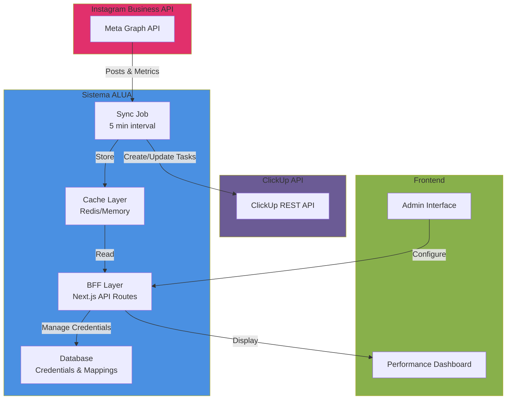
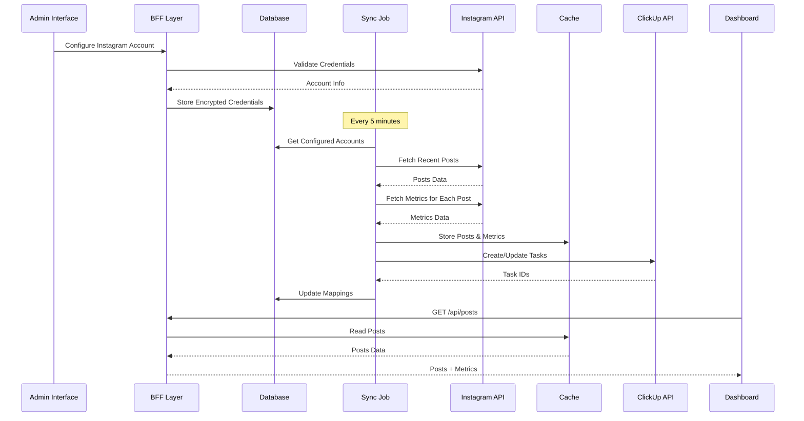
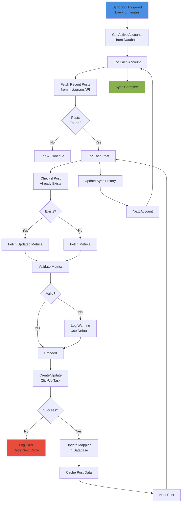

# Design Técnico: Integração Instagram Business

## Overview

Este documento descreve a arquitetura técnica para integração do Instagram Business API com o sistema ALUA Produtora. A integração automatiza a sincronização de posts e métricas do Instagram com o ClickUp, mantendo o Performance Dashboard atualizado em tempo real (5 minutos).

## Arquitetura Geral



## Fluxo de Dados Completo



## Componentes Principais

### 1. Instagram Service (`lib/services/instagram.service.ts`)

Serviço responsável por todas as interações com Instagram API.

```typescript
interface InstagramServiceConfig {
  accessToken: string
  businessAccountId: string
  accountName: string
}

interface InstagramPost {
  id: string
  caption: string
  mediaType: 'IMAGE' | 'VIDEO' | 'CAROUSEL'
  mediaUrl: string | null
  timestamp: string
  permalink: string
  publishedAt: string
}

interface InstagramMetrics {
  postId: string
  alcance: number
  engajamento: number
  impressoes: number
  cliques: number
  likes: number
  comments: number
  retrievedAt: string
}

class InstagramService {
  constructor(config: InstagramServiceConfig)
  
  // Validação de credenciais
  async validateCredentials(): Promise<boolean>
  
  // Buscar posts recentes
  async fetchRecentPosts(
    since?: Date,
    limit?: number
  ): Promise<InstagramPost[]>
  
  // Buscar métricas de um post
  async fetchPostMetrics(postId: string): Promise<InstagramMetrics>
  
  // Buscar métricas em batch
  async fetchPostMetricsBatch(
    postIds: string[]
  ): Promise<InstagramMetrics[]>
  
  // Tratamento de erros com retry
  private async retryWithBackoff<T>(
    fn: () => Promise<T>,
    maxRetries?: number
  ): Promise<T>
}
```

### 2. Sync Job Scheduler (`lib/jobs/instagram-sync.job.ts`)

Orquestrador do processo de sincronização.

```typescript
interface SyncJobConfig {
  frequencyMinutes: number
  maxConcurrentAccounts: number
  timeoutSeconds: number
}

interface SyncResult {
  accountId: string
  accountName: string
  postsProcessed: number
  tasksCreated: number
  tasksUpdated: number
  metricsUpdated: number
  errors: SyncError[]
  duration: number
  timestamp: string
}

interface SyncError {
  type: 'INSTAGRAM_API' | 'CLICKUP_API' | 'VALIDATION' | 'UNKNOWN'
  message: string
  context: Record<string, any>
  timestamp: string
}

class InstagramSyncJob {
  constructor(config: SyncJobConfig)
  
  // Iniciar scheduler
  start(): void
  
  // Parar scheduler
  stop(): void
  
  // Executar sync manualmente
  async runSync(): Promise<SyncResult[]>
  
  // Sincronizar uma conta específica
  private async syncAccount(
    accountId: string
  ): Promise<SyncResult>
  
  // Processar posts e métricas
  private async processPostsAndMetrics(
    posts: InstagramPost[],
    accountId: string
  ): Promise<void>
  
  // Criar ou atualizar task no ClickUp
  private async createOrUpdateClickUpTask(
    post: InstagramPost,
    metrics: InstagramMetrics,
    accountId: string
  ): Promise<string>
}
```

### 3. Data Normalization (`lib/utils/instagram-normalizer.ts`)

Normaliza dados do Instagram para o formato ALUA.

```typescript
interface NormalizedPost {
  id: string
  title: string
  imageUrl: string | null
  status: 'Publicado' | 'Agendado' | 'Rascunho'
  metrics: {
    alcance: number
    engajamento: number
    impressoes: number
    cliques: number
    likes: number
    comments: number
  }
  createdAt: string
  publishedAt: string | null
  instagramAccountName: string
  instagramPostId: string
  instagramPermalink: string
}

class InstagramNormalizer {
  static normalizePost(
    igPost: InstagramPost,
    metrics: InstagramMetrics,
    accountName: string
  ): NormalizedPost
  
  static validateMetrics(metrics: InstagramMetrics): boolean
  
  static ensureMetricsConsistency(
    metrics: InstagramMetrics
  ): InstagramMetrics
}
```

### 4. Credential Manager (`lib/services/credential-manager.ts`)

Gerencia armazenamento seguro de credenciais.

```typescript
interface StoredCredential {
  accountId: string
  accountName: string
  businessAccountId: string
  accessToken: string // Encrypted
  clickupListId: string
  isActive: boolean
  createdAt: string
  lastValidatedAt: string
  expiresAt?: string
}

class CredentialManager {
  // Armazenar credenciais criptografadas
  async storeCredential(
    credential: Omit<StoredCredential, 'createdAt'>
  ): Promise<void>
  
  // Recuperar credenciais descriptografadas
  async getCredential(accountId: string): Promise<StoredCredential>
  
  // Listar todas as credenciais (sem tokens)
  async listCredentials(): Promise<Omit<StoredCredential, 'accessToken'>[]>
  
  // Validar e renovar token se necessário
  async validateAndRefreshToken(accountId: string): Promise<boolean>
  
  // Deletar credenciais
  async deleteCredential(accountId: string): Promise<void>
  
  // Criptografar/descriptografar
  private encryptToken(token: string): string
  private decryptToken(encrypted: string): string
}
```

### 5. Post-ClickUp Mapper (`lib/services/post-clickup-mapper.ts`)

Mapeia posts do Instagram para tasks do ClickUp.

```typescript
interface ClickUpTaskData {
  name: string
  description: string
  custom_fields: {
    'Alcance': number
    'Engajamento': number
    'Impressões': number
    'Cliques': number
    'Likes': number
    'Comments': number
    'Instagram_Post_ID': string
    'Instagram_Account_Name': string
    'Instagram_Permalink': string
  }
  status: string
}

class PostClickUpMapper {
  static mapToClickUpTask(
    post: NormalizedPost,
    metrics: InstagramMetrics
  ): ClickUpTaskData
  
  static extractMetricsFromTask(
    task: any
  ): Partial<InstagramMetrics>
  
  static shouldUpdateMetrics(
    oldMetrics: InstagramMetrics,
    newMetrics: InstagramMetrics
  ): boolean
}
```

## Estrutura de Dados

### Database Schema

```sql
-- Tabela de credenciais do Instagram
CREATE TABLE instagram_credentials (
  id UUID PRIMARY KEY DEFAULT gen_random_uuid(),
  account_id VARCHAR(255) UNIQUE NOT NULL,
  account_name VARCHAR(255) NOT NULL,
  business_account_id VARCHAR(255) NOT NULL,
  access_token_encrypted TEXT NOT NULL,
  clickup_list_id VARCHAR(255) NOT NULL,
  is_active BOOLEAN DEFAULT true,
  created_at TIMESTAMP DEFAULT CURRENT_TIMESTAMP,
  last_validated_at TIMESTAMP,
  expires_at TIMESTAMP,
  created_by UUID NOT NULL REFERENCES auth.users(id),
  updated_at TIMESTAMP DEFAULT CURRENT_TIMESTAMP
);

-- Tabela de mapeamento Instagram <-> ClickUp
CREATE TABLE instagram_post_mappings (
  id UUID PRIMARY KEY DEFAULT gen_random_uuid(),
  instagram_post_id VARCHAR(255) NOT NULL,
  instagram_account_id VARCHAR(255) NOT NULL REFERENCES instagram_credentials(account_id),
  clickup_task_id VARCHAR(255) NOT NULL,
  clickup_list_id VARCHAR(255) NOT NULL,
  last_metrics_update TIMESTAMP,
  created_at TIMESTAMP DEFAULT CURRENT_TIMESTAMP,
  updated_at TIMESTAMP DEFAULT CURRENT_TIMESTAMP,
  UNIQUE(instagram_post_id, instagram_account_id)
);

-- Tabela de histórico de sincronização
CREATE TABLE instagram_sync_history (
  id UUID PRIMARY KEY DEFAULT gen_random_uuid(),
  account_id VARCHAR(255) NOT NULL REFERENCES instagram_credentials(account_id),
  status VARCHAR(50) NOT NULL, -- 'success', 'partial', 'failed'
  posts_processed INTEGER,
  tasks_created INTEGER,
  tasks_updated INTEGER,
  metrics_updated INTEGER,
  error_message TEXT,
  duration_ms INTEGER,
  started_at TIMESTAMP DEFAULT CURRENT_TIMESTAMP,
  completed_at TIMESTAMP
);

-- Índices para performance
CREATE INDEX idx_instagram_credentials_account_id ON instagram_credentials(account_id);
CREATE INDEX idx_instagram_credentials_is_active ON instagram_credentials(is_active);
CREATE INDEX idx_instagram_post_mappings_post_id ON instagram_post_mappings(instagram_post_id);
CREATE INDEX idx_instagram_post_mappings_account_id ON instagram_post_mappings(instagram_account_id);
CREATE INDEX idx_instagram_sync_history_account_id ON instagram_sync_history(account_id);
CREATE INDEX idx_instagram_sync_history_created_at ON instagram_sync_history(created_at);
```

### Cache Strategy

```typescript
interface CacheConfig {
  ttl: number // 5 minutes = 300 seconds
  maxSize: number // Max items in cache
  strategy: 'LRU' | 'FIFO'
}

// Cache keys
const CACHE_KEYS = {
  POSTS: (accountId: string) => `instagram:posts:${accountId}`,
  METRICS: (postId: string) => `instagram:metrics:${postId}`,
  ACCOUNT_STATUS: (accountId: string) => `instagram:status:${accountId}`,
  SYNC_LOCK: (accountId: string) => `instagram:sync:lock:${accountId}`,
}

// Implementação com Redis ou Memory
class CacheManager {
  async get<T>(key: string): Promise<T | null>
  async set<T>(key: string, value: T, ttl?: number): Promise<void>
  async delete(key: string): Promise<void>
  async clear(): Promise<void>
}
```

## APIs e Endpoints

### Instagram API Endpoints Utilizados

```
GET /me/instagram_business_accounts
  - Validar credenciais e obter account info

GET /{business_account_id}/media
  - Buscar posts recentes
  - Parâmetros: fields, limit, after (pagination)

GET /{media_id}/insights
  - Buscar métricas de um post
  - Métricas: reach, engagement, impressions, clicks, likes, comments

GET /{business_account_id}/insights
  - Buscar métricas agregadas da conta
```

### Endpoints ALUA Novos

```typescript
// Admin Interface
POST /api/admin/instagram/accounts
  - Adicionar nova conta Instagram
  - Body: { accountName, businessAccountId, accessToken, clickupListId }
  - Response: { success, accountId, message }

GET /api/admin/instagram/accounts
  - Listar contas configuradas
  - Response: { accounts: StoredCredential[] }

PUT /api/admin/instagram/accounts/:accountId
  - Atualizar configuração de conta
  - Body: { accountName?, clickupListId?, isActive? }

DELETE /api/admin/instagram/accounts/:accountId
  - Deletar conta
  - Response: { success, message }

POST /api/admin/instagram/sync
  - Disparar sincronização manual
  - Response: { results: SyncResult[] }

GET /api/admin/instagram/sync-history
  - Histórico de sincronizações
  - Query: { accountId?, limit, offset }
  - Response: { history: SyncHistory[], total }

GET /api/admin/instagram/status
  - Status atual de todas as contas
  - Response: { accounts: AccountStatus[] }

// Webhook (Future)
POST /api/instagram/webhooks
  - Receber eventos do Instagram
  - Body: { object, entry[] }
```

## Fluxo de Sincronização (5 minutos)



## Segurança

### Armazenamento de Credenciais

```typescript
// Environment Variables (Production)
INSTAGRAM_ENCRYPTION_KEY=<32-byte-hex-key>
INSTAGRAM_VAULT_URL=<vault-service-url>

// Implementação
class CredentialEncryption {
  private encryptionKey: Buffer
  
  encrypt(token: string): string {
    const iv = crypto.randomBytes(16)
    const cipher = crypto.createCipheriv('aes-256-gcm', this.encryptionKey, iv)
    const encrypted = Buffer.concat([
      cipher.update(token, 'utf8'),
      cipher.final()
    ])
    const authTag = cipher.getAuthTag()
    return Buffer.concat([iv, authTag, encrypted]).toString('base64')
  }
  
  decrypt(encrypted: string): string {
    const buffer = Buffer.from(encrypted, 'base64')
    const iv = buffer.slice(0, 16)
    const authTag = buffer.slice(16, 32)
    const encryptedData = buffer.slice(32)
    
    const decipher = crypto.createDecipheriv('aes-256-gcm', this.encryptionKey, iv)
    decipher.setAuthTag(authTag)
    
    return decipher.update(encryptedData) + decipher.final('utf8')
  }
}
```

### Validação de Permissões

```typescript
// Verificar permissões necessárias
const REQUIRED_PERMISSIONS = [
  'instagram_business_content_read',
  'instagram_business_insights_read'
]

async function validatePermissions(accessToken: string): Promise<boolean> {
  const response = await fetch(
    `https://graph.instagram.com/me?fields=permissions&access_token=${accessToken}`
  )
  const data = await response.json()
  
  return REQUIRED_PERMISSIONS.every(perm =>
    data.permissions?.some(p => p.permission === perm && p.status === 'granted')
  )
}
```

### Audit Logging

```typescript
interface AuditLog {
  id: string
  action: 'CREATE' | 'UPDATE' | 'DELETE' | 'VALIDATE' | 'SYNC'
  resourceType: 'CREDENTIAL' | 'MAPPING' | 'SYNC'
  resourceId: string
  userId: string
  changes: Record<string, any>
  status: 'SUCCESS' | 'FAILURE'
  errorMessage?: string
  timestamp: string
  ipAddress: string
}

class AuditLogger {
  async log(entry: Omit<AuditLog, 'id' | 'timestamp'>): Promise<void>
  async getHistory(filters: AuditLogFilters): Promise<AuditLog[]>
}
```

## Tratamento de Erros e Retry

```typescript
interface RetryConfig {
  maxRetries: number
  initialDelayMs: number
  maxDelayMs: number
  backoffMultiplier: number
}

class RetryStrategy {
  async executeWithRetry<T>(
    fn: () => Promise<T>,
    config: RetryConfig
  ): Promise<T> {
    let lastError: Error
    let delay = config.initialDelayMs
    
    for (let attempt = 0; attempt <= config.maxRetries; attempt++) {
      try {
        return await fn()
      } catch (error) {
        lastError = error
        
        if (attempt < config.maxRetries) {
          await new Promise(resolve => setTimeout(resolve, delay))
          delay = Math.min(
            delay * config.backoffMultiplier,
            config.maxDelayMs
          )
        }
      }
    }
    
    throw lastError
  }
}

// Configurações por tipo de erro
const RETRY_CONFIGS = {
  INSTAGRAM_API: {
    maxRetries: 3,
    initialDelayMs: 1000,
    maxDelayMs: 60000,
    backoffMultiplier: 2
  },
  CLICKUP_API: {
    maxRetries: 2,
    initialDelayMs: 500,
    maxDelayMs: 10000,
    backoffMultiplier: 2
  },
  NETWORK: {
    maxRetries: 5,
    initialDelayMs: 2000,
    maxDelayMs: 120000,
    backoffMultiplier: 2
  }
}
```

## Performance e Escalabilidade

### Batch Processing

```typescript
class BatchProcessor {
  async processBatch<T, R>(
    items: T[],
    processor: (item: T) => Promise<R>,
    batchSize: number = 10,
    delayMs: number = 100
  ): Promise<R[]> {
    const results: R[] = []
    
    for (let i = 0; i < items.length; i += batchSize) {
      const batch = items.slice(i, i + batchSize)
      const batchResults = await Promise.all(
        batch.map(item => processor(item))
      )
      results.push(...batchResults)
      
      if (i + batchSize < items.length) {
        await new Promise(resolve => setTimeout(resolve, delayMs))
      }
    }
    
    return results
  }
}
```

### Rate Limiting

```typescript
class RateLimiter {
  private tokens: number
  private lastRefillTime: number
  
  constructor(
    private maxTokens: number,
    private refillRatePerSecond: number
  ) {
    this.tokens = maxTokens
    this.lastRefillTime = Date.now()
  }
  
  async acquire(tokens: number = 1): Promise<void> {
    while (!this.canAcquire(tokens)) {
      await new Promise(resolve => setTimeout(resolve, 100))
    }
    this.tokens -= tokens
  }
  
  private canAcquire(tokens: number): boolean {
    this.refill()
    return this.tokens >= tokens
  }
  
  private refill(): void {
    const now = Date.now()
    const timePassed = (now - this.lastRefillTime) / 1000
    this.tokens = Math.min(
      this.maxTokens,
      this.tokens + timePassed * this.refillRatePerSecond
    )
    this.lastRefillTime = now
  }
}

// Limites do Instagram API
const INSTAGRAM_RATE_LIMITS = {
  POSTS_PER_SECOND: 10,
  METRICS_PER_SECOND: 20,
  MAX_CONCURRENT_REQUESTS: 5
}
```

## Estrutura de Arquivos

```
lib/
├── services/
│   ├── instagram.service.ts          # Interação com Instagram API
│   ├── credential-manager.ts         # Gerenciamento de credenciais
│   ├── post-clickup-mapper.ts        # Mapeamento para ClickUp
│   └── cache-manager.ts              # Gerenciamento de cache
├── jobs/
│   └── instagram-sync.job.ts         # Scheduler de sincronização
├── utils/
│   ├── instagram-normalizer.ts       # Normalização de dados
│   ├── retry-strategy.ts             # Estratégia de retry
│   ├── rate-limiter.ts               # Rate limiting
│   └── batch-processor.ts            # Processamento em batch
└── types/
    └── instagram.types.ts            # Tipos TypeScript

app/api/
├── admin/
│   └── instagram/
│       ├── accounts/
│       │   ├── route.ts              # GET, POST, PUT, DELETE
│       │   └── route.test.ts
│       ├── sync/
│       │   ├── route.ts              # POST (manual trigger)
│       │   └── route.test.ts
│       ├── sync-history/
│       │   ├── route.ts              # GET
│       │   └── route.test.ts
│       └── status/
│           ├── route.ts              # GET
│           └── route.test.ts
└── instagram/
    └── webhooks/
        ├── route.ts                  # POST (future)
        └── route.test.ts

modules/performance/
├── components/
│   └── InstagramPostCard.tsx         # Componente para posts do Instagram
└── hooks/
    └── useInstagramData.ts           # Hook para dados do Instagram

modules/admin/
└── components/
    ├── InstagramAccountForm.tsx      # Formulário de configuração
    ├── InstagramAccountList.tsx      # Lista de contas
    ├── SyncJobStatus.tsx             # Status de sincronização
    └── SyncHistory.tsx               # Histórico de syncs
```

## Integração com Sistema Existente

### Reutilização de Componentes

```typescript
// Usar componentes existentes de Performance
import { PostCard } from '@/modules/performance/components'
import { MetricDisplay } from '@/modules/performance/components'

// Estender tipos existentes
interface Post {
  // ... campos existentes
  source: 'clickup' | 'instagram'
  instagramAccountName?: string
}

// Usar hook existente
import { usePerformanceData } from '@/modules/performance/hooks'

// Estender para incluir dados do Instagram
const { posts, loading } = usePerformanceData({
  includeSources: ['clickup', 'instagram']
})
```

### Integração com ClickUp Service

```typescript
// Usar ClickUp Service existente
import { ClickUpService } from '@/lib/services/clickup.service'

class InstagramSyncJob {
  constructor(
    private instagramService: InstagramService,
    private clickupService: ClickUpService,
    private credentialManager: CredentialManager
  ) {}
  
  async syncAccount(accountId: string): Promise<SyncResult> {
    // Usar ClickUp Service para criar/atualizar tasks
    const task = await this.clickupService.createTask({
      list_id: mappedListId,
      name: post.title,
      description: post.description,
      custom_fields: metrics
    })
  }
}
```

## Correctness Properties

```typescript
// Property 1: Deduplication
// ∀ post ∈ Instagram: 
//   (post.id exists in ClickUp) ⟹ (exactly one ClickUp task for post.id)

// Property 2: Metrics Consistency
// ∀ metrics: 
//   (metrics.likes ≤ metrics.engajamento) ∧
//   (metrics.comments ≤ metrics.engajamento) ∧
//   (metrics.engajamento ≤ metrics.impressoes) ∧
//   (all metrics ≥ 0)

// Property 3: Sync Atomicity
// ∀ sync cycle:
//   (sync succeeds) ⟹ (all posts updated) ∨ (all posts rolled back)

// Property 4: Credential Security
// ∀ accessToken:
//   (token in database) ⟹ (token is encrypted) ∧
//   (token not in logs) ∧
//   (token not in API responses)

// Property 5: Account Isolation
// ∀ account1, account2 ∈ configured_accounts:
//   (account1 ≠ account2) ⟹ (posts from account1 not visible to account2)

// Property 6: Sync Frequency
// ∀ sync cycles:
//   (time between syncs) ≤ 5 minutes + processing_time

// Property 7: Error Recovery
// ∀ failed_sync:
//   (retry with exponential backoff) ∧
//   (max 3 retries) ∧
//   (circuit breaker after 5 consecutive failures)
```

## Exemplo de Uso Completo

```typescript
// 1. Configurar conta Instagram
const response = await fetch('/api/admin/instagram/accounts', {
  method: 'POST',
  headers: { 'Authorization': `Bearer ${token}` },
  body: JSON.stringify({
    accountName: 'ALUA Produtora',
    businessAccountId: '123456789',
    accessToken: 'EAAB...',
    clickupListId: 'list-123'
  })
})

// 2. Disparar sincronização manual
const syncResponse = await fetch('/api/admin/instagram/sync', {
  method: 'POST',
  headers: { 'Authorization': `Bearer ${token}` }
})

// 3. Ver posts no dashboard
const postsResponse = await fetch('/api/posts?period=week', {
  headers: { 'Authorization': `Bearer ${token}` }
})
// Retorna posts do Instagram + ClickUp

// 4. Monitorar status
const statusResponse = await fetch('/api/admin/instagram/status', {
  headers: { 'Authorization': `Bearer ${token}` }
})
```

## Próximos Passos

1. **Webhook Support**: Implementar webhooks do Instagram para sincronização em tempo real
2. **Advanced Analytics**: Adicionar análises comparativas entre contas
3. **Scheduled Posts**: Suportar posts agendados do Instagram
4. **Multi-Language**: Suportar captions em múltiplos idiomas
5. **Media Download**: Fazer download de mídia para backup local
6. **Reels Support**: Adicionar suporte para Instagram Reels
7. **Stories Support**: Adicionar suporte para Instagram Stories (com insights)
