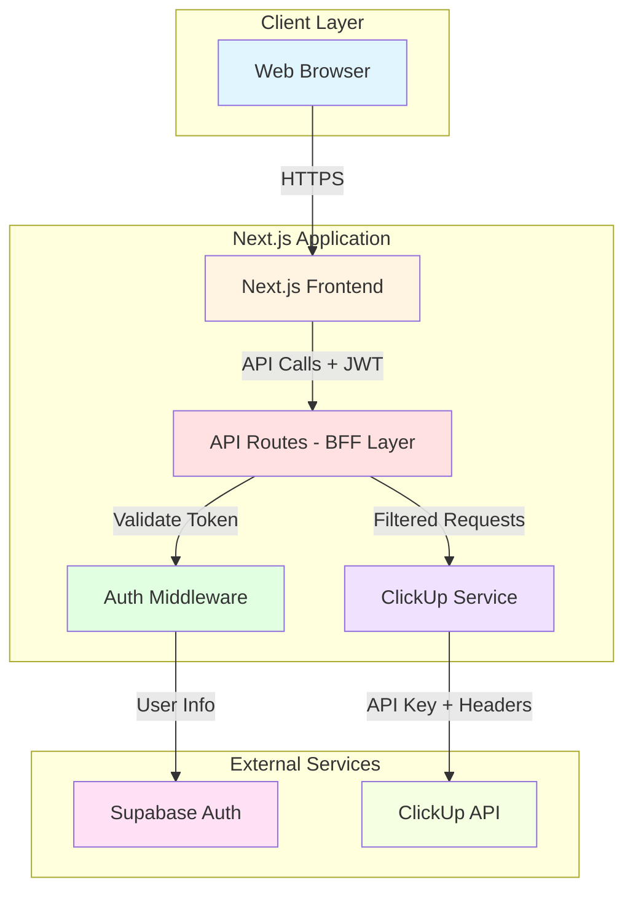
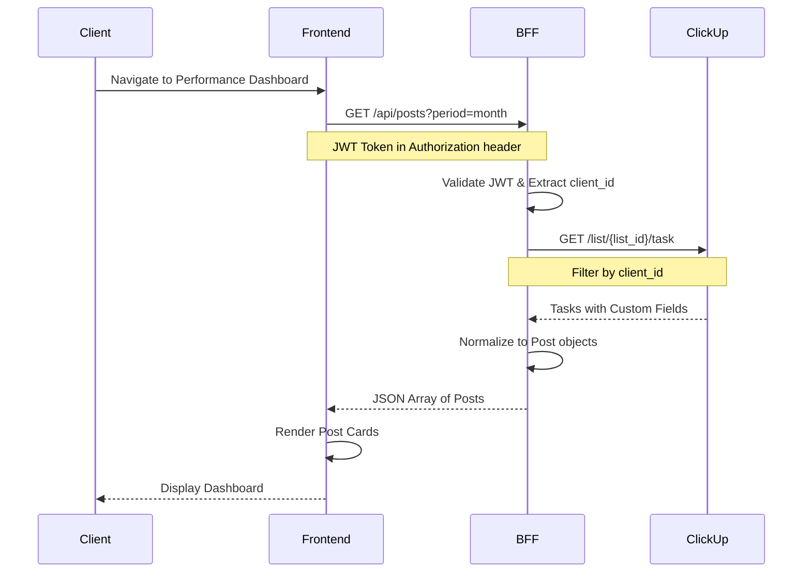
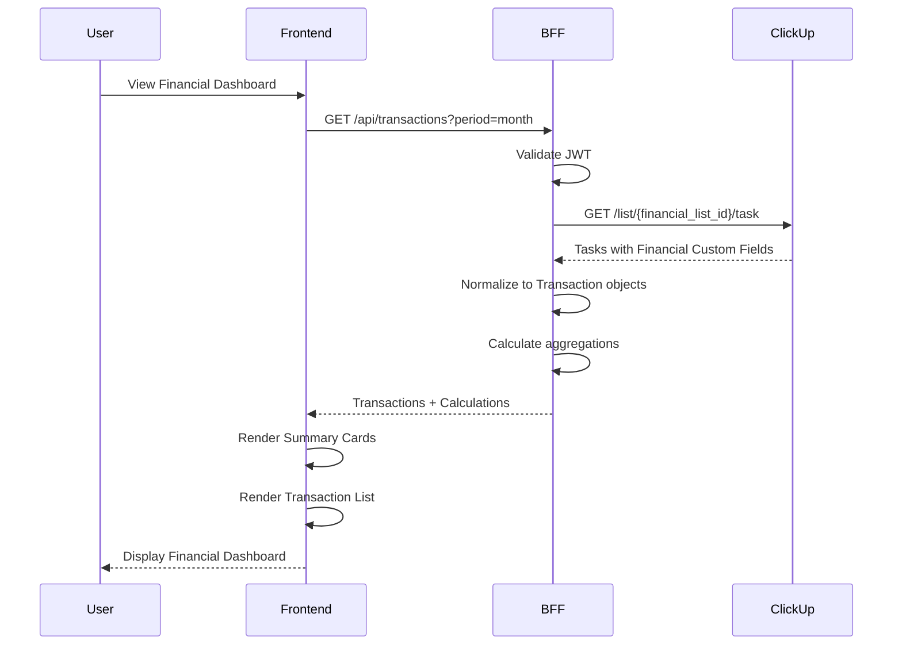
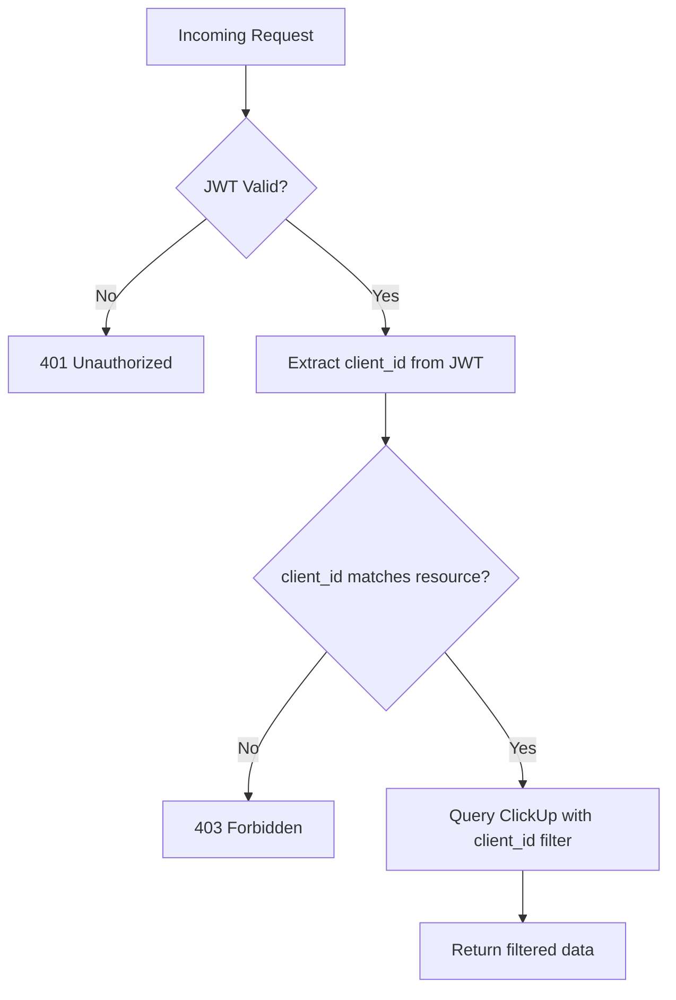

# Design Document: Portal de Performance + Gestão Financeira

## Overview

### System Purpose

The Portal de Performance + Gestão Financeira is a dual-module web application that provides:

1. **Performance Module**: A client-facing dashboard displaying real-time social media post metrics sourced from ClickUp
2. **Financial Module**: An internal cash flow management system for agency financial operations

The system eliminates the need for clients to access ClickUp directly while providing the agency with centralized financial control.

### Architecture Pattern

The system follows a **Backend-for-Frontend (BFF)** architecture where:
- All ClickUp API interactions are handled server-side through Next.js API Routes
- The BFF layer provides security, access control, and data normalization
- Multi-tenant isolation is enforced through client_id filtering at the BFF layer
- The frontend receives normalized, domain-specific data structures

### Technology Stack

- **Frontend Framework**: Next.js 14+ (App Router)
- **UI Styling**: TailwindCSS with custom design system
- **Authentication**: Supabase Auth
- **State Management**: React Query (TanStack Query) for server state
- **API Integration**: ClickUp REST API
- **Backend**: Next.js API Routes (serverless functions)
- **Deployment**: Vercel (recommended) or similar edge platform

### Key Design Principles

1. **Security First**: API keys never exposed to client, all external calls proxied through BFF
2. **Multi-Tenancy**: Strict data isolation per client_id
3. **Performance**: Aggressive caching with background revalidation
4. **Modularity**: Clear separation between Performance and Financial modules
5. **Extensibility**: Dynamic field mapping to support future ClickUp custom fields without code changes

## Architecture

### System Architecture Diagram



### Component Architecture

```mermaid
graph LR
    subgraph "Frontend Modules"
        A[Performance Module]
        B[Financial Module]
        C[Shared Components]
        D[Auth Context]
    end
    
    subgraph "BFF Layer"
        E[/api/posts]
        F[/api/transactions]
        G[Auth Middleware]
    end
    
    subgraph "Services"
        H[ClickUp Service]
        I[Data Normalizer]
        J[Cache Manager]
    end
    
    A --> E
    B --> F
    E --> G
    F --> G
    G --> H
    H --> I
    E --> J
    F --> J
```

### Data Flow Architecture

**Performance Module Flow:**



**Financial Module Flow:**



### Multi-Tenant Architecture



### Module Structure

```
/app
  /api
    /posts
      route.ts          # Performance API endpoint
    /transactions
      route.ts          # Financial API endpoint
    /auth
      route.ts          # Authentication endpoint
  /(dashboard)
    /performance
      page.tsx          # Performance dashboard
    /finance
      page.tsx          # Financial dashboard
    layout.tsx          # Shared dashboard layout
  /login
    page.tsx            # Login page

/modules
  /performance
    /components
      PostCard.tsx
      MetricDisplay.tsx
      PeriodFilter.tsx
    /hooks
      usePerformanceData.ts
    /types
      post.types.ts
  /finance
    /components
      TransactionList.tsx
      SummaryCard.tsx
      TransactionForm.tsx
    /hooks
      useFinancialData.ts
    /utils
      calculations.ts
    /types
      transaction.types.ts
  /shared
    /components
      Navigation.tsx
      ErrorBoundary.tsx
      LoadingState.tsx
    /hooks
      useAuth.ts

/services
  /clickup
    client.ts           # ClickUp API client
    normalizer.ts       # Data transformation
    types.ts            # ClickUp API types
  /auth
    supabase.ts         # Supabase client

/lib
  /design-system
    colors.ts           # Color palette
    typography.ts       # Font system
    spacing.ts          # Spacing scale
```

## Components and Interfaces

### Frontend Components

#### Performance Module Components

**PostCard Component**
```typescript
interface PostCardProps {
  post: Post;
  onImageError?: () => void;
}

// Displays a single post with:
// - Thumbnail image (with fallback)
// - Status badge
// - Metrics grid (Alcance, Engajamento, Impressões, Cliques)
```

**MetricDisplay Component**
```typescript
interface MetricDisplayProps {
  label: string;
  value: number;
  icon?: React.ReactNode;
  format?: 'number' | 'percentage';
}

// Reusable metric display with icon and formatted value
```

**PeriodFilter Component**
```typescript
interface PeriodFilterProps {
  selected: 'week' | 'month';
  onChange: (period: 'week' | 'month') => void;
}

// Toggle between week and month views
```

#### Financial Module Components

**SummaryCard Component**
```typescript
interface SummaryCardProps {
  title: string;
  value: number;
  subtitle?: string;
  trend?: 'up' | 'down' | 'neutral';
  variant: 'primary' | 'success' | 'warning' | 'danger';
}

// Displays financial summary metrics
// - Faturamento Bruto
// - Faturamento Líquido
// - Saldo Atual
```

**TransactionList Component**
```typescript
interface TransactionListProps {
  transactions: Transaction[];
  onSort?: (field: keyof Transaction) => void;
  sortField?: keyof Transaction;
  sortDirection?: 'asc' | 'desc';
}

// Displays sortable list of transactions with status indicators
```

**TransactionForm Component**
```typescript
interface TransactionFormProps {
  onSubmit: (data: TransactionInput) => Promise<void>;
  onCancel: () => void;
  initialData?: Partial<TransactionInput>;
}

// Form for creating/editing transactions
```

#### Shared Components

**Navigation Component**
```typescript
interface NavigationProps {
  currentModule: 'performance' | 'finance';
  userRole: 'client' | 'internal';
}

// Main navigation between modules
// Conditionally shows modules based on user role
```

**ErrorBoundary Component**
```typescript
interface ErrorBoundaryProps {
  children: React.ReactNode;
  fallback?: React.ReactNode;
  onError?: (error: Error) => void;
}

// Catches and displays errors gracefully
```

### API Interfaces

#### Performance API

**GET /api/posts**

Request:
```typescript
interface GetPostsRequest {
  period?: 'week' | 'month';
  client_id?: string; // Extracted from JWT, not query param
}
```

Response:
```typescript
interface GetPostsResponse {
  posts: Post[];
  metadata: {
    total: number;
    period: string;
    startDate: string;
    endDate: string;
  };
}
```

#### Financial API

**GET /api/transactions**

Request:
```typescript
interface GetTransactionsRequest {
  period?: 'week' | 'month' | 'year';
  startDate?: string;
  endDate?: string;
}
```

Response:
```typescript
interface GetTransactionsResponse {
  transactions: Transaction[];
  summary: FinancialSummary;
  projections: CashFlowProjection;
}
```

**POST /api/transactions**

Request:
```typescript
interface CreateTransactionRequest {
  valor: number;
  tipo: 'Entrada' | 'Saída';
  status: 'Pago' | 'Pendente' | 'Atrasado';
  dataVencimento: string; // ISO 8601
  impostosTaxas?: number;
  parcelamento?: string; // e.g., "3/10"
  descricao?: string;
}
```

Response:
```typescript
interface CreateTransactionResponse {
  success: boolean;
  transaction: Transaction;
  clickupTaskId: string;
}
```

### Service Interfaces

#### ClickUp Service

```typescript
interface ClickUpService {
  // Performance methods
  getTasksByList(listId: string, filters?: TaskFilters): Promise<ClickUpTask[]>;
  
  // Financial methods
  createTask(listId: string, taskData: CreateTaskPayload): Promise<ClickUpTask>;
  updateTask(taskId: string, updates: Partial<CreateTaskPayload>): Promise<ClickUpTask>;
  
  // Custom field methods
  getCustomFields(listId: string): Promise<CustomField[]>;
  mapCustomFields(task: ClickUpTask, fieldMap: FieldMapping): Record<string, any>;
}
```

#### Data Normalizer

```typescript
interface DataNormalizer {
  normalizePost(clickupTask: ClickUpTask, fieldMap: FieldMapping): Post;
  normalizeTransaction(clickupTask: ClickUpTask, fieldMap: FieldMapping): Transaction;
  normalizeCustomFieldValue(field: CustomField, value: any): any;
}
```

#### Auth Service

```typescript
interface AuthService {
  signIn(email: string, password: string): Promise<AuthResponse>;
  signOut(): Promise<void>;
  getSession(): Promise<Session | null>;
  refreshToken(): Promise<string>;
}

interface AuthResponse {
  user: User;
  session: Session;
  token: string;
}
```

## Data Models

### Domain Models

#### Post Model (Performance Module)

```typescript
interface Post {
  id: string;                    // ClickUp task ID
  title: string;                 // Task name
  imageUrl: string | null;       // Image attachment URL
  status: PostStatus;            // Post publication status
  metrics: PostMetrics;          // Performance metrics
  createdAt: string;             // ISO 8601 timestamp
  publishedAt: string | null;    // ISO 8601 timestamp
  clientId: string;              // Multi-tenant identifier
}

type PostStatus = 
  | 'Publicado' 
  | 'Agendado' 
  | 'Rascunho' 
  | 'Arquivado';

interface PostMetrics {
  alcance: number;               // Reach
  engajamento: number;           // Engagement
  impressoes: number;            // Impressions
  cliques: number;               // Clicks
}
```

#### Transaction Model (Financial Module)

```typescript
interface Transaction {
  id: string;                    // ClickUp task ID
  descricao: string;             // Description
  valor: number;                 // Amount in BRL
  tipo: TransactionType;         // Income or Expense
  status: TransactionStatus;     // Payment status
  dataVencimento: string;        // Due date (ISO 8601)
  impostosTaxas: number;         // Taxes and fees
  parcelamento: Installment | null; // Installment info
  createdAt: string;             // ISO 8601 timestamp
  clientId: string;              // Multi-tenant identifier
}

type TransactionType = 'Entrada' | 'Saída';

type TransactionStatus = 
  | 'Pago' 
  | 'Pendente' 
  | 'Atrasado';

interface Installment {
  current: number;               // Current installment number
  total: number;                 // Total installments
  valuePerInstallment: number;   // Calculated value per installment
}
```

#### Financial Summary Model

```typescript
interface FinancialSummary {
  faturamentoBruto: number;      // Gross revenue (sum of all Entrada)
  faturamentoLiquido: number;    // Net revenue (gross - taxes)
  saldoAtual: number;            // Current balance (paid income - paid expenses)
  totalImpostos: number;         // Total taxes and fees
  period: {
    startDate: string;
    endDate: string;
  };
}
```

#### Cash Flow Projection Model

```typescript
interface CashFlowProjection {
  projecaoEntradas: number;      // Projected income
  projecaoSaidas: number;        // Projected expenses
  saldoProjetado: number;        // Projected balance
  futureTransactions: Transaction[]; // Transactions with future due dates
}
```

### ClickUp Integration Models

#### ClickUp Task Model

```typescript
interface ClickUpTask {
  id: string;
  name: string;
  description: string;
  status: {
    status: string;
    color: string;
  };
  date_created: string;
  date_updated: string;
  custom_fields: CustomField[];
  attachments: Attachment[];
  list: {
    id: string;
    name: string;
  };
}

interface CustomField {
  id: string;
  name: string;
  type: 'number' | 'text' | 'drop_down' | 'date' | 'url' | 'attachment';
  value: any;
  type_config?: {
    options?: Array<{
      id: string;
      name: string;
      color: string;
    }>;
  };
}

interface Attachment {
  id: string;
  url: string;
  title: string;
  extension: string;
}
```

#### Field Mapping Configuration

```typescript
interface FieldMapping {
  performance: {
    alcance: string;             // Custom field ID for Alcance
    engajamento: string;         // Custom field ID for Engajamento
    impressoes: string;          // Custom field ID for Impressões
    cliques: string;             // Custom field ID for Cliques
    status: string;              // Custom field ID for Status
    imagem: string;              // Custom field ID for Imagem
  };
  financial: {
    valor: string;               // Custom field ID for Valor
    tipo: string;                // Custom field ID for Tipo
    status: string;              // Custom field ID for Status
    dataVencimento: string;      // Custom field ID for Data de Vencimento
    impostosTaxas: string;       // Custom field ID for Impostos/Taxas
    parcelamento: string;        // Custom field ID for Parcelamento
  };
}
```

### Authentication Models

#### User Model

```typescript
interface User {
  id: string;
  email: string;
  clientId: string;              // Links user to ClickUp lists
  role: UserRole;
  metadata: {
    name?: string;
    company?: string;
  };
}

type UserRole = 'client' | 'internal';
```

#### Session Model

```typescript
interface Session {
  accessToken: string;           // JWT token
  refreshToken: string;
  expiresAt: number;             // Unix timestamp
  user: User;
}
```

### Configuration Models

#### Environment Configuration

```typescript
interface EnvironmentConfig {
  clickup: {
    apiKey: string;
    performanceListId: string;
    financialListId: string;
    baseUrl: string;
  };
  supabase: {
    url: string;
    anonKey: string;
  };
  app: {
    baseUrl: string;
    environment: 'development' | 'staging' | 'production';
  };
}
```

### Database Schema (Supabase)

```sql
-- Users table (extends Supabase auth.users)
CREATE TABLE public.profiles (
  id UUID REFERENCES auth.users PRIMARY KEY,
  email TEXT NOT NULL,
  client_id TEXT NOT NULL,
  role TEXT NOT NULL CHECK (role IN ('client', 'internal')),
  metadata JSONB DEFAULT '{}',
  created_at TIMESTAMP WITH TIME ZONE DEFAULT NOW(),
  updated_at TIMESTAMP WITH TIME ZONE DEFAULT NOW()
);

-- Client configuration table
CREATE TABLE public.client_config (
  client_id TEXT PRIMARY KEY,
  clickup_performance_list_id TEXT NOT NULL,
  clickup_financial_list_id TEXT,
  field_mappings JSONB NOT NULL,
  created_at TIMESTAMP WITH TIME ZONE DEFAULT NOW(),
  updated_at TIMESTAMP WITH TIME ZONE DEFAULT NOW()
);

-- Indexes
CREATE INDEX idx_profiles_client_id ON public.profiles(client_id);
CREATE INDEX idx_profiles_email ON public.profiles(email);
```

## Design System

### Color Palette

#### Primary Colors

```typescript
const colors = {
  primary: {
    50: '#f0f9ff',   // Lightest blue
    100: '#e0f2fe',
    200: '#bae6fd',
    300: '#7dd3fc',
    400: '#38bdf8',
    500: '#0ea5e9',  // Main brand color
    600: '#0284c7',
    700: '#0369a1',
    800: '#075985',
    900: '#0c4a6e',  // Darkest blue
  },
  
  secondary: {
    50: '#faf5ff',   // Lightest purple
    100: '#f3e8ff',
    200: '#e9d5ff',
    300: '#d8b4fe',
    400: '#c084fc',
    500: '#a855f7',  // Main secondary color
    600: '#9333ea',
    700: '#7e22ce',
    800: '#6b21a8',
    900: '#581c87',  // Darkest purple
  },
}
```

#### Status Colors

```typescript
const statusColors = {
  success: {
    light: '#d1fae5',  // Light green background
    main: '#10b981',   // Green for "Pago" status
    dark: '#059669',
    text: '#065f46',
  },
  
  warning: {
    light: '#fef3c7',  // Light yellow background
    main: '#f59e0b',   // Yellow for "Pendente" status
    dark: '#d97706',
    text: '#92400e',
  },
  
  danger: {
    light: '#fee2e2',  // Light red background
    main: '#ef4444',   // Red for "Atrasado" status
    dark: '#dc2626',
    text: '#991b1b',
  },
  
  info: {
    light: '#dbeafe',
    main: '#3b82f6',
    dark: '#2563eb',
    text: '#1e40af',
  },
}
```

#### Neutral Colors

```typescript
const neutralColors = {
  white: '#ffffff',
  gray: {
    50: '#f9fafb',
    100: '#f3f4f6',
    200: '#e5e7eb',
    300: '#d1d5db',
    400: '#9ca3af',
    500: '#6b7280',
    600: '#4b5563',
    700: '#374151',
    800: '#1f2937',
    900: '#111827',
  },
  black: '#000000',
}
```

#### Background Colors

```typescript
const backgroundColors = {
  page: '#f9fafb',        // Main page background (gray-50)
  card: '#ffffff',        // Card background
  cardHover: '#f3f4f6',   // Card hover state (gray-100)
  sidebar: '#ffffff',     // Sidebar background
  header: '#ffffff',      // Header background
}
```

### Typography

```typescript
const typography = {
  fontFamily: {
    sans: ['Inter', 'system-ui', 'sans-serif'],
    mono: ['JetBrains Mono', 'Courier New', 'monospace'],
  },
  
  fontSize: {
    xs: '0.75rem',      // 12px
    sm: '0.875rem',     // 14px
    base: '1rem',       // 16px
    lg: '1.125rem',     // 18px
    xl: '1.25rem',      // 20px
    '2xl': '1.5rem',    // 24px
    '3xl': '1.875rem',  // 30px
    '4xl': '2.25rem',   // 36px
    '5xl': '3rem',      // 48px
  },
  
  fontWeight: {
    normal: 400,
    medium: 500,
    semibold: 600,
    bold: 700,
  },
  
  lineHeight: {
    tight: 1.25,
    normal: 1.5,
    relaxed: 1.75,
  },
}
```

### Spacing System

```typescript
const spacing = {
  0: '0',
  1: '0.25rem',   // 4px
  2: '0.5rem',    // 8px
  3: '0.75rem',   // 12px
  4: '1rem',      // 16px
  5: '1.25rem',   // 20px
  6: '1.5rem',    // 24px
  8: '2rem',      // 32px
  10: '2.5rem',   // 40px
  12: '3rem',     // 48px
  16: '4rem',     // 64px
  20: '5rem',     // 80px
  24: '6rem',     // 96px
}
```

### Component Styles

#### Card Component

```typescript
const cardStyles = {
  base: 'bg-white rounded-lg shadow-sm border border-gray-200',
  hover: 'hover:shadow-md transition-shadow duration-200',
  padding: 'p-6',
  
  variants: {
    default: 'bg-white',
    elevated: 'shadow-lg',
    outlined: 'border-2 border-gray-300',
  },
}
```

#### Button Component

```typescript
const buttonStyles = {
  base: 'inline-flex items-center justify-center rounded-lg font-medium transition-colors duration-200',
  
  sizes: {
    sm: 'px-3 py-1.5 text-sm',
    md: 'px-4 py-2 text-base',
    lg: 'px-6 py-3 text-lg',
  },
  
  variants: {
    primary: 'bg-primary-500 text-white hover:bg-primary-600',
    secondary: 'bg-secondary-500 text-white hover:bg-secondary-600',
    outline: 'border-2 border-primary-500 text-primary-500 hover:bg-primary-50',
    ghost: 'text-gray-700 hover:bg-gray-100',
    danger: 'bg-red-500 text-white hover:bg-red-600',
  },
}
```

#### Input Component

```typescript
const inputStyles = {
  base: 'w-full rounded-lg border border-gray-300 px-4 py-2 text-base focus:outline-none focus:ring-2 focus:ring-primary-500 focus:border-transparent',
  error: 'border-red-500 focus:ring-red-500',
  disabled: 'bg-gray-100 cursor-not-allowed',
}
```

#### Badge Component

```typescript
const badgeStyles = {
  base: 'inline-flex items-center px-2.5 py-0.5 rounded-full text-xs font-medium',
  
  variants: {
    success: 'bg-green-100 text-green-800',
    warning: 'bg-yellow-100 text-yellow-800',
    danger: 'bg-red-100 text-red-800',
    info: 'bg-blue-100 text-blue-800',
    neutral: 'bg-gray-100 text-gray-800',
  },
}
```

### Shadows and Elevation

```typescript
const shadows = {
  sm: '0 1px 2px 0 rgba(0, 0, 0, 0.05)',
  base: '0 1px 3px 0 rgba(0, 0, 0, 0.1), 0 1px 2px 0 rgba(0, 0, 0, 0.06)',
  md: '0 4px 6px -1px rgba(0, 0, 0, 0.1), 0 2px 4px -1px rgba(0, 0, 0, 0.06)',
  lg: '0 10px 15px -3px rgba(0, 0, 0, 0.1), 0 4px 6px -2px rgba(0, 0, 0, 0.05)',
  xl: '0 20px 25px -5px rgba(0, 0, 0, 0.1), 0 10px 10px -5px rgba(0, 0, 0, 0.04)',
}
```

### Layout Specifications

#### Dashboard Layout

```typescript
const dashboardLayout = {
  sidebar: {
    width: '256px',      // 16rem
    background: 'white',
    borderRight: '1px solid #e5e7eb',
  },
  
  header: {
    height: '64px',      // 4rem
    background: 'white',
    borderBottom: '1px solid #e5e7eb',
  },
  
  content: {
    padding: '24px',     // 1.5rem
    maxWidth: '1440px',
    margin: '0 auto',
  },
}
```

#### Grid System

```typescript
const gridSystem = {
  mobile: {
    columns: 1,
    gap: '16px',
  },
  tablet: {
    columns: 2,
    gap: '20px',
  },
  desktop: {
    columns: 3,
    gap: '24px',
  },
  wide: {
    columns: 4,
    gap: '24px',
  },
}
```

#### Post Card Layout

```
┌─────────────────────────────┐
│                             │
│      [Thumbnail Image]      │
│         (16:9 ratio)        │
│                             │
├─────────────────────────────┤
│  [Status Badge]             │
│                             │
│  Alcance:        1,234      │
│  Engajamento:      567      │
│  Impressões:     8,901      │
│  Cliques:          123      │
│                             │
└─────────────────────────────┘
```

#### Financial Summary Cards Layout

```
┌──────────────┬──────────────┬──────────────┐
│ Saldo Atual  │ Fat. Bruto   │ Fat. Líquido │
│              │              │              │
│  R$ 45.000   │  R$ 120.000  │  R$ 95.000   │
│  ↑ +12%      │  ↑ +8%       │  ↑ +5%       │
└──────────────┴──────────────┴──────────────┘
```

#### Transaction List Layout

```
┌─────────────────────────────────────────────────────┐
│ Status │ Descrição      │ Tipo    │ Valor    │ Venc.│
├─────────────────────────────────────────────────────┤
│   🟢   │ Pagamento X    │ Entrada │ R$ 5.000 │ 15/01│
│   🟡   │ Fornecedor Y   │ Saída   │ R$ 2.000 │ 20/01│
│   🔴   │ Serviço Z      │ Saída   │ R$ 1.500 │ 10/01│
└─────────────────────────────────────────────────────┘
```

### Icons

Using **Lucide React** icon library:

```typescript
import {
  TrendingUp,      // For positive trends
  TrendingDown,    // For negative trends
  DollarSign,      // For financial values
  Calendar,        // For dates
  CheckCircle,     // For "Pago" status
  Clock,           // For "Pendente" status
  AlertCircle,     // For "Atrasado" status
  BarChart3,       // For metrics
  Eye,             // For impressions
  MousePointer,    // For clicks
  Heart,           // For engagement
  Users,           // For reach
} from 'lucide-react';
```


## Correctness Properties

*A property is a characteristic or behavior that should hold true across all valid executions of a system—essentially, a formal statement about what the system should do. Properties serve as the bridge between human-readable specifications and machine-verifiable correctness guarantees.*

This system contains several pure functions and business logic components that are well-suited for property-based testing. The following properties define universal behaviors that should hold across all valid inputs for data transformation, financial calculations, filtering, and validation logic.

### Property 1: JWT Client ID Extraction

*For any* valid JWT token containing a client_id claim, extracting the client_id SHALL successfully return the claim value without modification.

**Validates: Requirements 2.1**

### Property 2: Multi-Tenant Data Filtering

*For any* collection of data items with client_id fields and any target client_id, filtering the collection SHALL return only items where the item's client_id exactly matches the target client_id, and all returned items SHALL have matching client_id values.

**Validates: Requirements 2.2**

### Property 3: Authorization Enforcement

*For any* pair of client_id values (one from JWT, one from requested resource), when the JWT client_id does not match the resource client_id, the authorization check SHALL fail and return a 403 Forbidden status.

**Validates: Requirements 2.3**

### Property 4: Post Normalization Completeness

*For any* ClickUp task object with custom fields, transforming it to a Post object SHALL:
- Extract all specified custom fields (Alcance, Engajamento, Impressões, Cliques, Status, Imagem)
- Map custom field IDs to human-readable property names
- Provide default values (0 for numbers, empty string for text, null for optional fields) for any missing custom fields
- Convert all date fields to ISO 8601 format
- Remove unnecessary ClickUp metadata fields
- Produce a valid Post object with all required fields present

**Validates: Requirements 3.2, 3.3, 17.2, 17.3, 17.4, 17.5, 20.1**

### Property 5: Date Range Filtering

*For any* collection of posts with creation dates and any time period (start date, end date), filtering posts by the period SHALL return only posts where the creation date falls within the inclusive range [start date, end date], and no returned post SHALL have a date outside this range.

**Validates: Requirements 5.3**

### Property 6: Transaction Normalization Completeness

*For any* ClickUp task object with financial custom fields, transforming it to a Transaction object SHALL:
- Extract all specified custom fields (Valor, Tipo, Status, Data_de_Vencimento, Impostos_Taxas, Parcelamento)
- Map custom field IDs to human-readable property names
- Provide default values for any missing custom fields
- Convert all date fields to ISO 8601 format
- Remove unnecessary ClickUp metadata fields
- Produce a valid Transaction object with all required fields present

**Validates: Requirements 6.2, 6.3, 17.2, 17.3, 17.4, 17.5, 20.1**

### Property 7: Gross Revenue Calculation

*For any* collection of transactions within a time period, calculating gross revenue (Faturamento Bruto) SHALL equal the sum of the Valor field for all transactions where Tipo equals "Entrada" and the transaction falls within the period.

**Validates: Requirements 7.1**

### Property 8: Net Revenue Calculation

*For any* collection of income transactions, calculating net revenue (Faturamento Líquido) SHALL equal the gross revenue minus the sum of Impostos_Taxas for all income transactions.

**Validates: Requirements 7.2**

### Property 9: Current Balance Calculation

*For any* collection of transactions, calculating current balance (Saldo Atual) SHALL equal the sum of Valor for all transactions where Status equals "Pago" and Tipo equals "Entrada", minus the sum of Valor for all transactions where Status equals "Pago" and Tipo equals "Saída".

**Validates: Requirements 7.3**

### Property 10: Transaction Sorting Invariant

*For any* collection of transactions, sorting by Data_de_Vencimento in ascending order SHALL produce a list where for every adjacent pair of transactions (i, i+1), the date of transaction i is less than or equal to the date of transaction i+1.

**Validates: Requirements 8.4**

### Property 11: Future Transaction Filtering

*For any* collection of transactions and the current date, filtering for future transactions SHALL return only transactions where Data_de_Vencimento is strictly greater than the current date, and no returned transaction SHALL have a due date less than or equal to the current date.

**Validates: Requirements 9.1**

### Property 12: Projected Income Calculation

*For any* collection of future transactions, calculating projected income SHALL equal the sum of Valor for all transactions where Tipo equals "Entrada" and Data_de_Vencimento is greater than the current date.

**Validates: Requirements 9.2**

### Property 13: Projected Expenses Calculation

*For any* collection of future transactions, calculating projected expenses SHALL equal the sum of Valor for all transactions where Tipo equals "Saída" and Data_de_Vencimento is greater than the current date.

**Validates: Requirements 9.3**

### Property 14: Parcelamento Parsing

*For any* valid parcelamento string in the format "X/Y" (where X and Y are positive integers), parsing SHALL extract the current installment number X and total installments Y such that 1 ≤ X ≤ Y.

**Validates: Requirements 10.1**

### Property 15: Per-Installment Value Calculation

*For any* transaction with a valid parcelamento field containing total installments Y, calculating the per-installment value SHALL equal the transaction Valor divided by Y, and multiplying the per-installment value by Y SHALL equal the original Valor (within floating-point precision).

**Validates: Requirements 10.3**

### Property 16: Installment Distribution

*For any* transaction with parcelamento "X/Y" and due date D, distributing remaining installments across future months SHALL:
- Generate (Y - X + 1) separate transaction entries
- Assign each entry a value equal to Valor / Y
- Assign each entry a due date in sequential months starting from D
- Preserve all other transaction properties (Tipo, Status, etc.) in each entry
- Ensure the sum of all generated entry values equals the original transaction Valor

**Validates: Requirements 10.4, 10.5**

### Property 17: Input Validation Completeness

*For any* transaction input data, validation SHALL correctly identify all missing required fields (Valor, Tipo, Data_de_Vencimento, Status) and return a validation error if any required field is absent or null.

**Validates: Requirements 11.3**

## Error Handling

### Error Categories

The system handles four primary categories of errors:

1. **Authentication Errors** (401 Unauthorized)
   - Invalid credentials
   - Expired JWT tokens
   - Malformed JWT tokens
   - Missing authentication headers

2. **Authorization Errors** (403 Forbidden)
   - Client attempting to access another client's data
   - Invalid client_id in JWT
   - Insufficient permissions for requested operation

3. **External Service Errors** (502 Bad Gateway, 503 Service Unavailable)
   - ClickUp API unavailable
   - ClickUp API rate limiting
   - ClickUp API timeout
   - Network connectivity issues

4. **Validation Errors** (400 Bad Request)
   - Missing required fields
   - Invalid data types
   - Invalid date formats
   - Invalid parcelamento format
   - Out-of-range values

### Error Handling Strategy

#### BFF Layer Error Handling

```typescript
interface ErrorResponse {
  error: {
    code: string;           // Machine-readable error code
    message: string;        // User-friendly error message
    details?: any;          // Optional additional context (dev mode only)
  };
  timestamp: string;        // ISO 8601 timestamp
  path: string;             // Request path
}
```

**Error Handling Rules:**

1. **Logging**: All errors SHALL be logged server-side with full context (stack trace, request details, user info)
2. **Sanitization**: Error responses to frontend SHALL NOT expose internal implementation details, API keys, or sensitive data
3. **User-Friendly Messages**: Error messages SHALL be translated to Portuguese and provide actionable guidance
4. **Status Codes**: HTTP status codes SHALL accurately reflect the error category
5. **Retry Logic**: Transient errors (network, rate limiting) SHALL include retry-after headers

#### Frontend Error Handling

**Error Display Strategy:**

1. **Toast Notifications**: For transient errors and user actions (form submission, data refresh)
2. **Error Boundaries**: For component-level errors to prevent full app crashes
3. **Inline Validation**: For form validation errors displayed next to fields
4. **Error Pages**: For critical errors (authentication failure, service unavailable)

**Retry Mechanism:**

```typescript
interface RetryConfig {
  maxAttempts: 3;
  backoffMs: [1000, 2000, 4000];  // Exponential backoff
  retryableStatusCodes: [408, 429, 502, 503, 504];
}
```

### Specific Error Scenarios

#### ClickUp API Errors

**Scenario**: ClickUp API returns 429 (Rate Limit)
- **BFF Action**: Wait for rate limit reset, retry request
- **Frontend Action**: Display "Carregando dados..." message, automatic retry
- **User Impact**: Transparent, no user action required

**Scenario**: ClickUp API returns 500 (Internal Server Error)
- **BFF Action**: Log error with full context, return 502 to frontend
- **Frontend Action**: Display "Serviço temporariamente indisponível. Tente novamente em alguns minutos."
- **User Impact**: Manual retry available

**Scenario**: ClickUp API timeout (>10 seconds)
- **BFF Action**: Cancel request, log timeout, return 504 to frontend
- **Frontend Action**: Display "Tempo de resposta excedido. Verifique sua conexão."
- **User Impact**: Manual retry available

#### Authentication Errors

**Scenario**: JWT token expired
- **BFF Action**: Return 401 with error code "TOKEN_EXPIRED"
- **Frontend Action**: Attempt token refresh, if fails redirect to login
- **User Impact**: Automatic re-authentication or login prompt

**Scenario**: Invalid credentials on login
- **BFF Action**: Return 401 with error code "INVALID_CREDENTIALS"
- **Frontend Action**: Display "E-mail ou senha incorretos"
- **User Impact**: User corrects credentials and retries

#### Validation Errors

**Scenario**: Missing required field in transaction creation
- **BFF Action**: Return 400 with field-specific error messages
- **Frontend Action**: Highlight invalid fields in red, display inline error messages
- **User Impact**: User corrects fields and resubmits

**Scenario**: Invalid date format
- **BFF Action**: Return 400 with error code "INVALID_DATE_FORMAT"
- **Frontend Action**: Display "Formato de data inválido. Use DD/MM/AAAA"
- **User Impact**: User corrects date format

#### Data Integrity Errors

**Scenario**: ClickUp task missing expected custom fields
- **BFF Action**: Apply default values per Property 4 and Property 6, log warning
- **Frontend Action**: Display data with defaults, no error shown to user
- **User Impact**: Transparent, system handles gracefully

**Scenario**: Parcelamento parsing fails (invalid format)
- **BFF Action**: Set parcelamento to null, log warning, continue processing
- **Frontend Action**: Display transaction without installment info
- **User Impact**: Transaction visible, installment info unavailable

### Error Recovery

#### Automatic Recovery

1. **Token Refresh**: Automatically refresh expired tokens before showing login screen
2. **Retry with Backoff**: Automatically retry failed requests up to 3 times with exponential backoff
3. **Cache Fallback**: Display cached data when API is unavailable, with staleness indicator

#### Manual Recovery

1. **Retry Button**: All error notifications include a "Tentar Novamente" button
2. **Refresh Data**: Manual refresh button in dashboard headers
3. **Logout/Login**: Option to logout and re-authenticate for persistent auth errors

### Monitoring and Alerting

**Error Metrics to Track:**

1. Error rate by endpoint (errors per minute)
2. Error rate by error code
3. ClickUp API error rate
4. Authentication failure rate
5. Average error recovery time

**Alert Thresholds:**

- Error rate > 5% of total requests: Warning
- Error rate > 10% of total requests: Critical
- ClickUp API unavailable > 5 minutes: Critical
- Authentication failure rate > 20%: Warning

## Testing Strategy

### Testing Approach Overview

The testing strategy employs a multi-layered approach combining property-based testing, unit testing, integration testing, and end-to-end testing. Each layer serves a specific purpose in ensuring system correctness and reliability.

### Property-Based Testing (PBT)

**Library**: fast-check (for TypeScript/JavaScript)

**Scope**: Pure functions and business logic with universal properties

**Configuration**:
- Minimum 100 iterations per property test
- Each test tagged with format: `Feature: portal-performance-gestao-financeira, Property {number}: {property_text}`
- Seed-based reproducibility for failed test cases

**Property Test Coverage**:

All 17 correctness properties defined in the Correctness Properties section SHALL be implemented as property-based tests:

1. JWT client_id extraction (Property 1)
2. Multi-tenant filtering (Property 2)
3. Authorization enforcement (Property 3)
4. Post normalization (Property 4)
5. Date filtering (Property 5)
6. Transaction normalization (Property 6)
7. Gross revenue calculation (Property 7)
8. Net revenue calculation (Property 8)
9. Current balance calculation (Property 9)
10. Transaction sorting (Property 10)
11. Future transaction filtering (Property 11)
12. Projected income calculation (Property 12)
13. Projected expenses calculation (Property 13)
14. Parcelamento parsing (Property 14)
15. Per-installment calculation (Property 15)
16. Installment distribution (Property 16)
17. Input validation (Property 17)

**Generator Strategy**:

Custom generators SHALL be created for:
- ClickUp task objects with random custom fields
- Transaction collections with varied types, statuses, and dates
- JWT tokens with random claims
- Date ranges and time periods
- Parcelamento strings in valid format
- Invalid inputs for validation testing

**Example Property Test Structure**:

```typescript
import fc from 'fast-check';

describe('Feature: portal-performance-gestao-financeira, Property 7: Gross Revenue Calculation', () => {
  it('should calculate gross revenue as sum of all income transactions', () => {
    fc.assert(
      fc.property(
        fc.array(transactionGenerator()),
        (transactions) => {
          const grossRevenue = calculateGrossRevenue(transactions);
          const expectedRevenue = transactions
            .filter(t => t.tipo === 'Entrada')
            .reduce((sum, t) => sum + t.valor, 0);
          
          expect(grossRevenue).toBeCloseTo(expectedRevenue, 2);
        }
      ),
      { numRuns: 100 }
    );
  });
});
```

### Unit Testing

**Library**: Jest + React Testing Library

**Scope**: Individual functions, components, and modules

**Coverage Targets**:
- Business logic functions: 100%
- React components: 80%
- Utility functions: 100%

**Unit Test Focus**:

1. **Specific Examples**: Concrete test cases for common scenarios
2. **Edge Cases**: Boundary conditions (empty arrays, null values, zero amounts)
3. **Error Conditions**: Invalid inputs, missing data, malformed structures
4. **Component Behavior**: User interactions, state changes, conditional rendering

**Example Unit Test**:

```typescript
describe('TransactionList Component', () => {
  it('should display red indicator for overdue transactions', () => {
    const overdueTransaction = {
      id: '1',
      status: 'Atrasado',
      valor: 1000,
      tipo: 'Saída',
      dataVencimento: '2024-01-01',
    };
    
    render(<TransactionList transactions={[overdueTransaction]} />);
    
    const indicator = screen.getByTestId('status-indicator-1');
    expect(indicator).toHaveClass('bg-red-500');
  });
});
```

### Integration Testing

**Library**: Jest + MSW (Mock Service Worker)

**Scope**: API routes, external service integration, authentication flow

**Integration Test Focus**:

1. **API Endpoints**: Request/response validation, error handling
2. **ClickUp Integration**: Mocked ClickUp API responses
3. **Authentication Flow**: Supabase Auth integration
4. **Data Flow**: End-to-end data transformation from ClickUp to frontend

**Mock Strategy**:

- Use MSW to mock ClickUp API responses
- Use Supabase test client for auth testing
- Mock environment variables for configuration testing

**Example Integration Test**:

```typescript
describe('GET /api/posts', () => {
  it('should return filtered posts for authenticated client', async () => {
    const mockJWT = generateMockJWT({ client_id: 'client-123' });
    
    server.use(
      rest.get('https://api.clickup.com/api/v2/list/:listId/task', (req, res, ctx) => {
        return res(ctx.json({ tasks: mockClickUpTasks }));
      })
    );
    
    const response = await fetch('/api/posts?period=month', {
      headers: { Authorization: `Bearer ${mockJWT}` }
    });
    
    const data = await response.json();
    
    expect(response.status).toBe(200);
    expect(data.posts).toHaveLength(5);
    expect(data.posts.every(p => p.clientId === 'client-123')).toBe(true);
  });
});
```

### End-to-End Testing

**Library**: Playwright

**Scope**: Critical user journeys, cross-browser compatibility

**E2E Test Focus**:

1. **Authentication Flow**: Login → Dashboard navigation
2. **Performance Module**: View posts → Apply filters → View metrics
3. **Financial Module**: View transactions → Create transaction → View updated summary
4. **Error Scenarios**: Network failures, session expiration

**E2E Test Coverage**:

- Happy path for each module
- Error recovery flows
- Mobile and desktop viewports
- Chrome, Firefox, Safari browsers

**Example E2E Test**:

```typescript
test('should display performance dashboard after login', async ({ page }) => {
  await page.goto('/login');
  await page.fill('[name="email"]', 'client@example.com');
  await page.fill('[name="password"]', 'password123');
  await page.click('button[type="submit"]');
  
  await page.waitForURL('/performance');
  
  const postCards = await page.locator('[data-testid="post-card"]').count();
  expect(postCards).toBeGreaterThan(0);
});
```

### Visual Regression Testing

**Library**: Playwright + Percy or Chromatic

**Scope**: UI components, responsive layouts, design system

**Visual Test Focus**:

1. **Component Library**: All design system components
2. **Responsive Layouts**: Mobile, tablet, desktop viewports
3. **Status Indicators**: Color-coded transaction statuses
4. **Dark Mode**: (if implemented)

### Performance Testing

**Library**: Lighthouse CI + k6

**Scope**: Page load times, API response times, bundle size

**Performance Targets**:

- Initial page load: < 2 seconds
- API response time: < 500ms (p95)
- Time to Interactive: < 3 seconds
- Bundle size: < 200KB (gzipped)

**Performance Test Scenarios**:

1. Dashboard load with 100 posts
2. Financial calculations with 1000 transactions
3. Concurrent user load (50 users)

### Security Testing

**Scope**: Authentication, authorization, data exposure

**Security Test Focus**:

1. **JWT Validation**: Expired tokens, invalid signatures, missing claims
2. **Multi-Tenant Isolation**: Attempt to access other client's data
3. **API Key Protection**: Verify key not exposed in client code or network
4. **Input Sanitization**: SQL injection, XSS attempts (though using ClickUp API, not direct DB)

### Test Execution Strategy

**Development**:
- Unit tests: Run on file save (watch mode)
- Property tests: Run on commit
- Integration tests: Run on commit

**CI/CD Pipeline**:
1. Unit tests + Property tests (parallel)
2. Integration tests
3. E2E tests (critical paths only)
4. Visual regression tests
5. Performance tests (on main branch only)

**Pre-Deployment**:
- Full test suite execution
- Security scan
- Performance benchmark
- Accessibility audit

### Test Data Management

**Strategy**:

1. **Generators**: Use fast-check generators for property tests
2. **Fixtures**: Maintain JSON fixtures for integration tests
3. **Factories**: Use factory functions for creating test data
4. **Seeding**: Seed-based randomization for reproducibility

**Example Factory**:

```typescript
function createMockTransaction(overrides?: Partial<Transaction>): Transaction {
  return {
    id: faker.string.uuid(),
    descricao: faker.commerce.productName(),
    valor: faker.number.float({ min: 100, max: 10000, precision: 0.01 }),
    tipo: faker.helpers.arrayElement(['Entrada', 'Saída']),
    status: faker.helpers.arrayElement(['Pago', 'Pendente', 'Atrasado']),
    dataVencimento: faker.date.future().toISOString(),
    impostosTaxas: faker.number.float({ min: 0, max: 1000, precision: 0.01 }),
    parcelamento: null,
    createdAt: faker.date.past().toISOString(),
    clientId: 'test-client-id',
    ...overrides,
  };
}
```

### Continuous Testing

**Monitoring in Production**:

1. **Synthetic Monitoring**: Automated tests running against production every 5 minutes
2. **Error Tracking**: Sentry or similar for runtime error monitoring
3. **Performance Monitoring**: Real User Monitoring (RUM) for actual user experience
4. **A/B Testing**: Feature flags for gradual rollout with metrics

### Test Documentation

Each test file SHALL include:
1. Description of what is being tested
2. Test scenarios covered
3. Known limitations or edge cases not covered
4. Links to related requirements

**Example Test Documentation**:

```typescript
/**
 * Financial Calculations Test Suite
 * 
 * Tests the core financial calculation functions used in the Financial Module.
 * 
 * Coverage:
 * - Gross revenue calculation (Property 7)
 * - Net revenue calculation (Property 8)
 * - Current balance calculation (Property 9)
 * - Edge cases: empty transactions, zero values, negative values
 * 
 * Related Requirements: 7.1, 7.2, 7.3
 * 
 * Known Limitations:
 * - Does not test floating-point precision edge cases beyond 2 decimal places
 * - Assumes BRL currency (no multi-currency support)
 */
```

